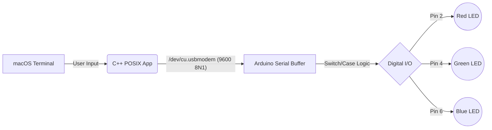

<div align="center">
  
# 🌈 MacRGB: Serial Arduino LED Controller

**A high-performance C++ POSIX terminal application for macOS to command Arduino-based RGB lighting systems over a serial interface.**


</div>

---

## 📖 Table of Contents
- [About The Project](#-about-the-project)
- [System Architecture](#-system-architecture)
- [Prerequisites & Tech Stack](#-prerequisites--tech-stack)
- [Hardware Configuration](#-hardware-configuration)
- [Installation & Setup](#-installation--setup)
  - [Arduino Setup (PlatformIO / Arduino IDE)](#arduino-setup)
  - [macOS C++ Setup](#macos-c-setup)
- [Usage Guide](#-usage-guide)
- [Example Session](#-example-session)
- [Under the Hood](#-under-the-hood)
- [Documentation Reference](#-documentation-reference)
- [Troubleshooting](#-troubleshooting)
- [Future Enhancements](#-future-enhancements)

---

## 🚀 About The Project

This project demonstrates low-level hardware control by bridging a Unix-based operating system (macOS) with microcontrollers (Arduino). Instead of relying on high-level UI frameworks or bulky serial libraries, we utilize **POSIX terminal I/O (`termios.h`)** in raw C++ to achieve direct, near-zero latency communication with an Arduino Uno over a USB-to-Serial interface. 

The system enables precise state control of RGB lighting directly from your terminal, providing a foundational architecture for more complex home automation, embedded systems engineering, or IoT projects.

---

## 🏗 System Architecture



---

## 🛠 Prerequisites & Tech Stack

To build and deploy this project, you will need the following software and hardware environments configured on your machine:

### 💻 Software Ecosystem
* **Operating System:** macOS (Required for POSIX `/dev/cu.*` serial port handling).
* **Compiler:** `clang++` or GCC (Apple clang version 14.0.0+ recommended).
* **Microcontroller Toolchains:** [Arduino IDE](https://www.arduino.cc/en/software) for simplicity, or [PlatformIO](https://platformio.org/) via VS Code for professional deployment.
* **Terminal Emulator:** iTerm2, macOS Terminal, or Alacritty.

### 🔌 Hardware Requirements
* 1x **Arduino Board** (Uno, Nano, Mega, etc.).
* 1x **RGB LED** (Common Cathode recommended) or 3x standard LEDs (Red, Green, Blue).
* 3x **Resistors** (220Ω or 330Ω to prevent LED burnout).
* Jumper Wires & a Breadboard.
* USB-A/USB-C to Arduino Data Cable.

---

## ⚡ Hardware Configuration

Carefully wire your components according to the following schematic logic:

| Component | Arduino Pin | Connection Route |
| :--- | :--- | :--- |
| **Red LED Anode** | Digital Pin `2` | Pin 2 ➔ Resistor ➔ Red Leg |
| **Green LED Anode** | Digital Pin `4` | Pin 4 ➔ Resistor ➔ Green Leg |
| **Blue LED Anode** | Digital Pin `6` | Pin 6 ➔ Resistor ➔ Blue Leg |
| **LED Cathode** | `GND` | Common Leg ➔ Arduino Ground |

> [!CAUTION]
> Always use current-limiting resistors inline with your LEDs. Connecting LEDs directly to digital pins can draw excessive current and permanently damage your microcontroller's GPIO pins!

---

## ⚙️ Installation & Setup

### Arduino Setup

You can deploy the firmware using either the standard Arduino IDE or PlatformIO.

<details>
<summary><strong>Option A: Using PlatformIO (Recommended)</strong></summary>

1. Initialize a new PlatformIO project in VS Code:
   ```bash
   pio project init --board uno
   ```
2. Place the `.ino` or `.cpp` firmware code inside the `src/` directory.
3. Build and upload via the PlatformIO CLI:
   ```bash
   pio run --target upload
   ```
</details>

<details>
<summary><strong>Option B: Using Arduino IDE</strong></summary>

1. Launch Arduino IDE and paste the `.ino` code.
2. Select your board (e.g., **Tools > Board > Arduino Uno**).
3. Select your serial port (**Tools > Port > /dev/cu.usbmodemXXXX**).
4. Click the **Upload** button.
</details>

### macOS C++ Setup

1. **Verify your Serial Port:**
   Find out what port your Arduino is connected to by running this command in your Mac terminal:
   ```bash
   ls /dev/cu.usbmodem*
   ```
2. **Update the Source Code:**
   Open `main.cpp` and update the `port` variable to match the output from the previous step:
   ```cpp
   const char* port = "/dev/cu.usbmodem1201"; // Ensure this matches your hardware!
   ```
3. **Compile the Binary:**
   Use `g++` (which aliases to clang on macOS) to compile the C++ application with optimization flags:
   ```bash
   g++ -O3 -Wall -std=c++17 main.cpp -o rgb_controller
   ```

---

## 🎮 Usage Guide

Once everything is wired and flashed, execute the compiled C++ binary from your terminal:

```bash
./rgb_controller
```

You will be greeted by the interactive terminal loop. The system accepts the following inputs (case-insensitive):

* `R` - Illuminates the **Red** light channel.
* `G` - Illuminates the **Green** light channel.
* `B` - Illuminates the **Blue** light channel.
* `Q` - Terminates the serial connection and exits the program gracefully.

---

## 💻 Example Session

Here is what a typical session looks like when running the application in your macOS terminal:

```console
$ ./rgb_controller
Enter command 'R' or 'G' or 'B' or 'Q'(to quit): R
Enter command 'R' or 'G' or 'B' or 'Q'(to quit): G
Enter command 'R' or 'G' or 'B' or 'Q'(to quit): x
Invalid Input
Enter command 'R' or 'G' or 'B' or 'Q'(to quit): Q
$ 
```

Simultaneously, if you are monitoring the Arduino's output via the **Arduino Serial Monitor** (or a logic analyzer), the microcontroller responds to these commands with:

```console
RED LIGHT ON
GREEN LIGHT ON
```

*(Note: The C++ application acts as a one-way transmitter. It commands the Arduino but does not block to read these return messages back into your macOS terminal.)*

---

## 🧠 Under the Hood

### The C++ POSIX Serial Implementation
The C++ host application leverages low-level UNIX file descriptors to treat the serial port as a raw data stream (`O_RDWR | O_NOCTTY`). We use the `<termios.h>` structure to enforce strict communication protocols:
- **Baud Rate:** `9600` (Synchronized with Arduino's `Serial.begin(9600)`)
- **Data Bits:** 8 (`CS8`)
- **Parity:** None (`~PARENB`)
- **Stop Bits:** 1 (`~CSTOPB`)
- **8N1 Protocol:** Together, this setup is known as standard 8N1 serial communication.

*Note: The script implements a `sleep(2)` delay upon opening the port. This is a critical timing mechanism because Arduino boards auto-reset their bootloader when a new serial connection is established over USB.*

### The Arduino Firmware
The microcontroller continuously polls its serial buffer using `Serial.available()`. When a byte arrives, it routes the logic through an efficient `switch` statement, manipulating GPIO registers via `digitalWrite()` to toggle the appropriate LED states while explicitly turning off the others to maintain pure RGB states without color bleeding.

---

## 📚 Documentation Reference

For deep dives into the technologies driving this project, consult the official documentation:

* **POSIX `termios` API:** [The Open Group Base Specifications (termios.h)](https://pubs.opengroup.org/onlinepubs/009696799/basedefs/termios.h.html)
* **UNIX `open()`/`read()`/`write()`:** [macOS System Calls Manual](https://developer.apple.com/library/archive/documentation/System/Conceptual/ManPages_iPhoneOS/man2/open.2.html)
* **Arduino Serial:** [Arduino Language Reference - Serial](https://www.arduino.cc/reference/en/language/functions/communication/serial/)
* **Arduino GPIO (`digitalWrite`):** [Arduino Reference - digitalWrite](https://www.arduino.cc/reference/en/language/functions/digital-io/digitalwrite/)
* **PlatformIO CLI:** [PlatformIO Core Documentation](https://docs.platformio.org/en/latest/core/index.html)

---

## 🐛 Troubleshooting

* **Error: "Could not open serial port"**
  * *Cause:* The port string in your C++ code doesn't match your actual hardware port, or another program (like the Arduino IDE Serial Monitor) is currently locking the port.
  * *Fix:* Close all Serial Monitors, run `ls /dev/cu.*` in terminal, update the path in `main.cpp`, and recompile.

* **Issue: Program runs, but LEDs don't change.**
  * *Cause:* Incorrect baud rate synchronization or missing delay on initialization.
  * *Fix:* Ensure the Arduino's `Serial.begin(9600)` matches the C++ `cfsetispeed(&tty, B9600)`.

* **Issue: LEDs are too dim or entirely off.**
  * *Cause:* Hardware wiring issue or reversed polarity.
  * *Fix:* Check that the common cathode is actually connected to ground, verify LED polarity, and ensure you aren't using overly high resistance values (stay around 220Ω-330Ω).

---

## 🔮 Future Enhancements
- [ ] **Hex Code Parsing:** Migrate from basic `R`/`G`/`B` characters to full Hex Color Code parsing (e.g., `#FF5733`).
- [ ] **PWM Blending:** Utilize Arduino PWM (`analogWrite()`) to mix colors dynamically and create gradients.
- [ ] **Cross-Platform:** Build a C++ abstraction layer to support Windows `COM` ports alongside POSIX paths.
- [ ] **GUI Dashboard:** Integrate a sleek graphical interface using **ImGui** or **Qt**.

---
<div align="center">
  <i>Engineered with 💻 and ☕ for macOS & Microcontrollers.</i>
</div>
